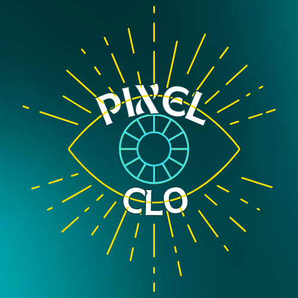

<!DOCTYPE html>
<html lang="fr">
<head>
    <meta charset="UTF-8">
    <meta name="viewport" content="width=device-width, initial-scale=1.0">
    <title>Tirage de cartes - Atypique !</title>
    
</head>
<body>
    <!-- Logo -->
    

    <!-- Titre du podcast -->
    <h1>Atypique !</h1>

    <!-- Bouton de tirage -->
    <button onclick="drawCard()">Tirer une carte</button>

    <!-- Zone d'affichage des résultats -->
    

    <!-- Script JavaScript pour le tirage -->
    
</body>
</html>
